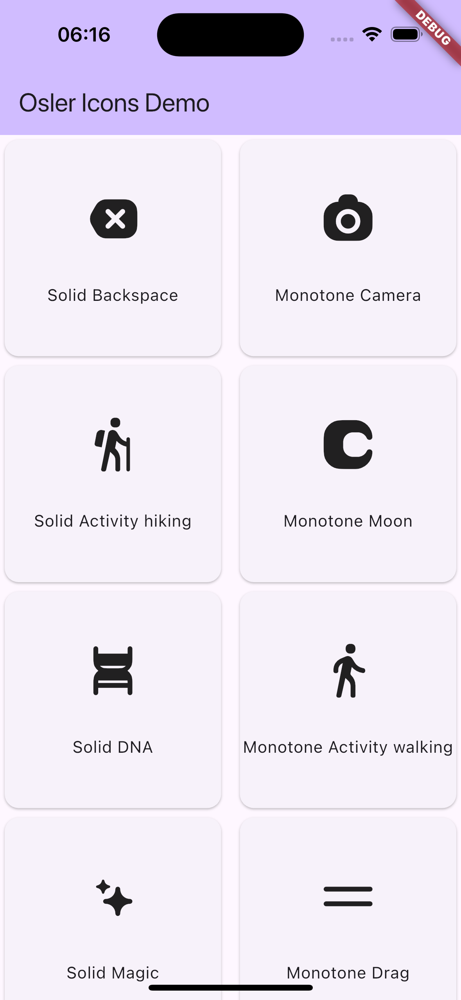

<!--
This README describes the package. If you publish this package to pub.dev,
this README's contents appear on the landing page for your package.

For information about how to write a good package README, see the guide for
[writing package pages](https://dart.dev/tools/pub/writing-package-pages).

For general information about developing packages, see the Dart guide for
[creating packages](https://dart.dev/guides/libraries/create-packages)
and the Flutter guide for
[developing packages and plugins](https://flutter.dev/to/develop-packages).
-->

[](https://pub.dartlang.org/packages/sandow_icons)
[](https://github.com/CoderNamedHendrick/sandow_icons/pulls)

# Osler Icons

Osler icons is from strange icons sandow icon pack with close to 500 regular icons in solid and
monotone styles.

Made from [StrangeIcons](https://www.strangeicons.com/).

## 🏅 Installation

Update dependencies of your pubspec.yaml, and add the following line

```yaml
osler_icons: 
```

or `flutter pub add osler_icons` from your terminal

## 🏗️ Usage

```dart
import 'package:osler_icons/osler_icons.dart';
import 'package:flutter/material.dart';

class IconWidget extends StatelessWidget {


  @override
  Widget build(BuildContext context) {
    return Card(
      child: Column(
        mainAxisAlignment: MainAxisAlignment.center,
        children: [
          Icon(OslerSolidIcons.dna),
          const SizedBox(height: 10),
          Text('Solid DNA')
        ],
      ),
    );
  }
}
```

## Example

View the flutter app in the `example` directory

## Screenshot



## 🐛 Bugs/Requests

If you encounter any problems feel free to open an issue. If you feel the library is
missing a feature, please raise a ticket on GitHub and I'll look into it.
Pull request are also welcome.

## ✅ Next steps

[ ] fix unavailable icons and add them to pack

[](https://github.com/CoderNamedHendrick)

#### **Sebastine Odeh**

<p>
<a href="https://x.com/H3ndrick_"></a>
<a href="https://www.linkedin.com/in/sebastine-odeh-1081a318b/"></a>
<a href="https://medium.com/@sebastinesoacatp"></a>
</p>
